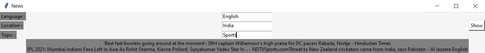
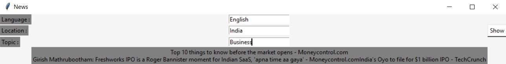

# Get_News
An Application using Python to extract news from Google News Feed

# Output:

 

 

### Note:
Install these libraries using the command below:

-> pip install gnewsclient (From getting the news from Google News Feed)

-> pip install python-Levenshtein (A better sequence matcher library)
